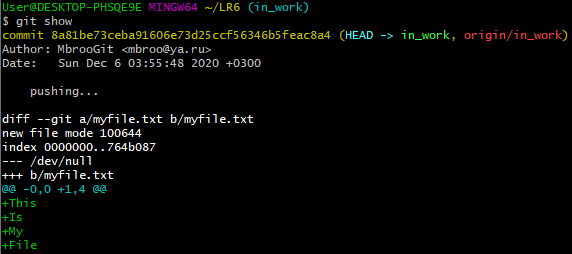

С помошью команды `git clone https://github.com/Kurtyanik/LR6` скопировал себе репозиторий.


Создал дополнительную ветку. Внутри папки создал файл с произвольным содержанием и добавил его в новую ветку. С помощью команды `git remote set-url origin https://github.com/mbroogit/LR6` поменял адрес удаленного репозитория, после чего загрузил изменения.


С помощью команды `git log` получил историю коммитов.


С помощью команды `git show` получил подробную информацию по последнему коммиту.




Переключился на ветку `git checkout master` и выполнил слияние ветки in_work, которое прошло без ошибок.


Удалил побочную ветку.


Выполнил хард-откат до версии "до изменений".


Лог команд:
```
git clone https://github.com/Kurtyanik/LR6
cd LR6 && ls -la
git checkout -b in_work
echo -e "This\nIs\nMy\nFile" > myfile.txt
cat myfile.txt
git add myfile.txt
git commit -m "pushing..."
git remote set-url origin https://github.com/mbroogit/LR6
git remote -v
git push origin in_work
git log
git show
git checkout master
git merge in_work
git branch -d in_work
git reset --hard 921f53b
```