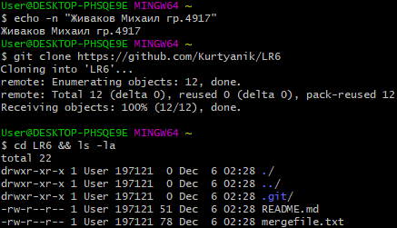
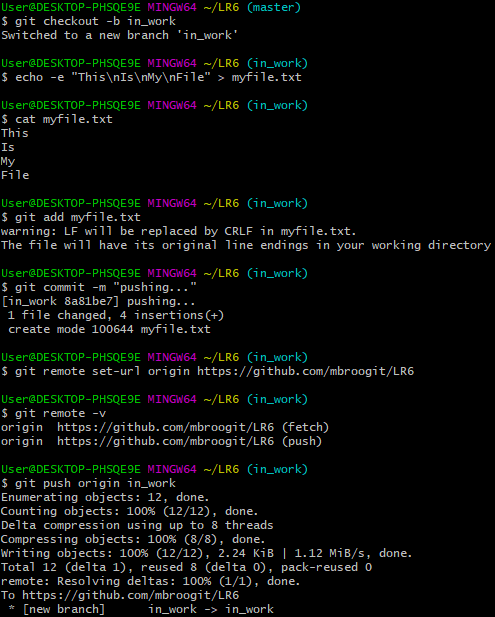
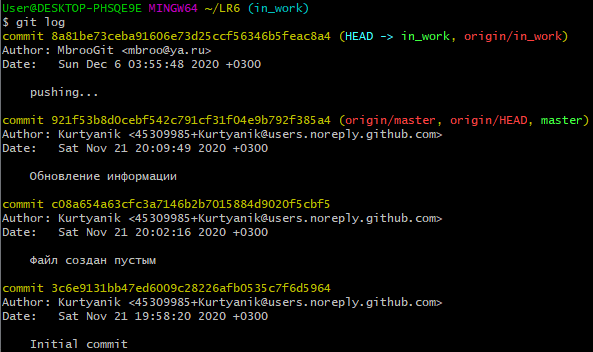
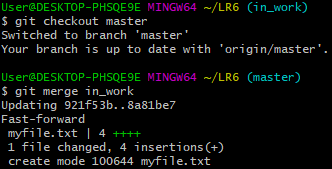
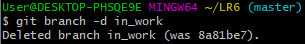
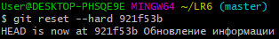

С помошью команды `git clone https://github.com/Kurtyanik/LR6` скопировал себе репозиторий.

Создал дополнительную ветку. Внутри папки создал файл с произвольным содержанием и добавил его в новую ветку. С помощью команды `git remote set-url origin https://github.com/mbroogit/LR6` поменял адрес удаленного репозитория, после чего загрузил изменения.

С помощью команды `git log` получил историю коммитов.

С помощью команды `git show` получил подробную информацию по последнему коммиту.

Переключился на ветку `git commit master` и выполнил слияние ветки in_work, которое прошло без ошибок.

Удалил побочную ветку.

Выполнил хард-откат до версии "до изменений".
